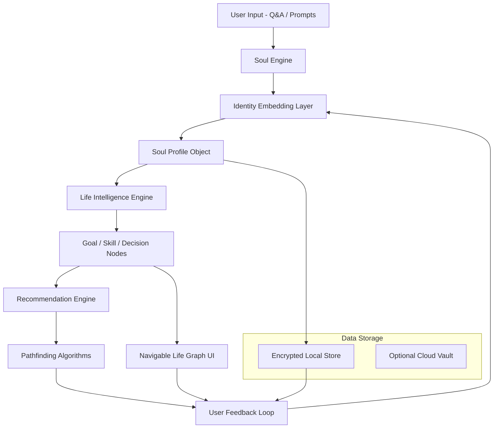

# LifeOS Whitepaper V3

## 🧭 Introduction

**LifeOS** is a modular, AI-powered, privacy-focused Life Operating System designed to help individuals define, refine, and pursue their purpose through intelligent, data-driven guidance. It blends deep identity modeling with dynamic life planning in a seamless, user-first interface. The platform is structured around two tightly integrated core modules:

- **Soul Engine** – The user identity and modeling engine.
- **Life Intelligence** – The dynamic decision graph engine for exploration and execution.

These modules work together within a unified, navigable graph-based interface that evolves with the user, enabling clarity, alignment, and action. Nodes may have a different behavior depending on the module that's being used (Soul Engine/Life Intelligence). *Subject to change*.

---

## 🔧 Core Modules Breakdown

### 🧬 1. Soul Engine (Identity Modeling)
*“Who am I?” — a map of identity, values, traits, motivations.*

- **Purpose:** Establish a deep psychological, philosophical, and behavioral model of the user.

- **Key Features:**

  - Initial profile creation via guided Q&A or minimal prompt input.
  - Continuous inference and updates through user interactions.
  - Semantic representation of values, beliefs, skills, fears, interests, and goals.
  - Vector embedding of identity traits for intelligent cross-referencing.

- **UX Representation:**

  - A mostly stable graph composed of self-defining nodes such as "Core Values," "Motivations," "Philosophy," etc.
  - This forms the backbone for the Life Intelligence engine.

- **Technical Implementation:**

  - Embedding engine built in Python (e.g., `sentence-transformers`).
  - Modular input pipeline using local-first logic and encrypted persistence.
  - Supports dynamic refinement through journaling and behavioral logging.

#### Node Representation (Soul Engine)

> - **Node meaning**: Core self-concepts (e.g., "Curiosity", "Desire for Autonomy", "Avoids Authority", "Privacy-Oriented", "Builder Archetype")
> 
> - **Node attributes**:
> 
>   - Type: Value / Trait / Constraint / Archetype / Meta-goal
>   - Source: Inferred vs. user-defined
>   - Strength/confidence
> 
> - **Graph edges**: Relationships between identity traits (e.g., “Curiosity” fuels “Desire to Explore”, “Builder” conflicts with “Need for Predictability”)
> 
> - **UX actions**:
> 
>   - Explore inferred identity structure
>   - Edit or confirm/refute nodes
>   - See identity shifts over time
>   - Export profile vector

---

### 🧠 2. Life Intelligence (Goal Mapping & Guidance)
*“What should I do?” — a map of actionable, outcome-based paths.*

- **Purpose:** Map personalized, actionable life paths aligned with the user's Soul Profile.

- **Key Features:**

  - Constructs a dynamic graph of possible futures: decisions, goals, transitions.
  - Uses context-aware node generation and real-time scoring.
  - Explores scenarios with constraints, trade-offs, and simulations.

- **UX Representation:**

  - A zoomable, interactive life graph where nodes represent decisions, milestones, and suggestions.
  - Allows branching and previewing of alternate paths.

- **Technical Implementation:**

  - Graph generation in Python using domain templates and LLMs.
  - Scoring based on alignment to Soul Engine, feasibility, cost, and impact.
  - Powered by `networkx` or `neo4j` with ML-based ranking of paths.
  - Action and feedback loop continuously improves node accuracy.

####  Node Representation (Life Intelligence)

> - **Node meaning**: States or decisions in real-world domains (e.g., "Launch Solo AI Product", "Join Small ML Startup", "Move to Japan", "Get VC Funding", "Burnout Risk")
> 
> - **Node attributes**:
> 
>   - Feasibility
>   - Impact vs. effort
>   - Alignment with Soul Engine
>   - Constraints (time, resources, social, psychological)
> 
> - **Graph edges**: Paths, dependencies, or tradeoffs between choices
> 
>   - E.g., "Join Startup" → "Learn Product Dev" → "Launch Venture"
> 
> - **UX actions**:
> 
>   - Simulate paths forward
>   - Filter based on personal values
>   - Lock or hide routes
>   - Create custom goals

---

### 3. DataLayer (Optional Enhancer)
#### Purpose:
Ingest optional user artifacts to deepen understanding with no extra input.

#### Sources:
- Markdown notes (Obsidian, Logseq)
- Bookmarks (browser exports)
- Journals (free text)
- GitHub / commit history
- Personal metadata (file activity, system logs — local only)

#### Tools:
- `DataConnector`: Adapters for each source
- `TextEmbedder`: Embedding-based vector model for similarity search
- `InsightExtractor`: Matches external data with internal identity graph

---

## 🧠 Conceptual Architecture

```
          ┌────────────────────────┐
          │     User Input         │
          └────────┬───────────────┘
                   ▼
       ┌─────────────────────────────┐
       │      Soul Engine            │ ◄────────────┐
       │  (User Identity Model)      │              │
       └─────┬────────────┬──────────┘              │
             ▼            ▼                         │
   [ Primary Node ]   [ Supporting Nodes ]          │
    (Core values,     (Fears, skills, goals...)     │
     philosophy,                                    │
     worldview)                                     │
             │                                      │
             ▼                                      │
       ┌─────────────┐            ┌─────────────────▼────────────┐
       │ Soul Profile│───────────▶ Life Intelligence Engine      │
       │  (object)   │            │ (Navigable Decision Graph)   │
       └─────────────┘            └──────────────────────────────┘
                                        ▲            │
                                        │            ▼
                            ┌───────────┴───────┐┌────────────┐
                            │ Action Nodes      ││ Data Layer │
                            │ Suggestions,      ││ (Optional) │
                            │ Transitions, etc. │└────────────┘
                            └───────────────────┘
```

---

## 🧩 Technical Architecture (Mermaid)


Possible node example:
```json
{
  "id": "freedom",
  "type": "value",
  "label": "Freedom",
  "weight": 0.92,
  "source": "q1_user_input",
  "embedding": [...], // optional
  "tags": ["autonomy", "independence"]
}
```
So if a user says:

    "I value freedom, autonomy, and not having to answer to anyone."

You might extract 2–3 value nodes, each tagged, scored, and stored as individual entries in a personal identity graph.

---

## 🧪 Technology Stack

### 🧱 Backend (Python-first)

- **Language:** Python 3.11+
- **Libraries:**
  - NLP/Embeddings: `transformers`, `sentence-transformers`, `spacy`
  - Graph: `networkx`, `neo4j`, `igraph`
  - ML/Optimization: `scikit-learn`, `optuna`, `pydantic`
- **Storage:**
  - JSON + Encrypted SQLite
  - Optional secure cloud or IPFS vault

### 🖼 Frontend (Phase 2+)

- React (Next.js) + TailwindCSS / ShadCN
- Graph rendering: D3.js or Recharts
- Framer Motion for transitions

### 🔐 Privacy & Data Philosophy

- Default local-only computation and storage
- Optional decentralized cloud sync (IPFS, S3, etc.)
- Anonymous pattern sharing to enhance model without compromising identity

---

## 🧭 UX/UI Design Principles

- **Minimal Input Start:** Quick onboarding (5–10 minutes)
- **Graph-Based Interface:** Interactions via visually explorable graphs
- **Two Modes:**
  - Soul Mode → introspection & modeling
  - Explorer Mode → planning & decision navigation
- **User Ownership:**
  - Transparent identity logic
  - Portable profiles

### 🔁 Ideal UX Flow (v1)

1. User opens app → lands in Life Intelligence Graph (default UI)
2. Suggested next nodes/goals visible, possible paths highlighted
3. Clicking a node shows:
    - Its description
    - Estimated effort/impact
    - Alignment level with their Soul Engine profile
    - “Why this suggestion?” powered by explainability
4. Advanced/curious users can open the Soul Engine via a button/tab
    - View/edit profile
    - See how identity affects Life Graph recommendations
    - Possibly visualize evolution over time

This provides instant value while remaining deep and extensible.

---

## 📅 Updated Roadmap (V3)

### Phase 0 – Research & Modeling ✅

- Map core traits and motivations
- Define Soul vs Life Intelligence boundaries
- Design prototype input pipeline

### Phase 1 – Terminal MVP 🚧

- Minimal Python CLI prototype
- Q&A-based user profiling
- Static goal node template + basic CLI graph

### Phase 2 – Node Engine & Inference

- Semi-dynamic goal node generator
- Real-time suggestions from Soul Profile
- Initial scoring and path logic

### Phase 3 – Graph UI

- Frontend integration
- Node editing + feedback interface

### Phase 4 – Feedback Integration

- Logging, journaling, and sentiment extraction
- Soul Engine refinement
- LLM-guided graph expansion

### Phase 5 – Distributed Privacy Model

- Encrypted data containers
- IPFS/decentralized sync
- Aggregate pattern modeling (anonymized)

### Phase 6 – Automation Agents

- Transparent agents for retrieval, search, reminders
- No opaque behaviors — fully user-verifiable

---

## 🌱 Final Remarks

LifeOS is not just a planner—it's a platform for existential clarity. It respects autonomy, decentralizes ownership, and creates space for meaningful exploration. As development progresses, we aim to expand LifeOS into a global infrastructure for private, purpose-aligned intelligence.

